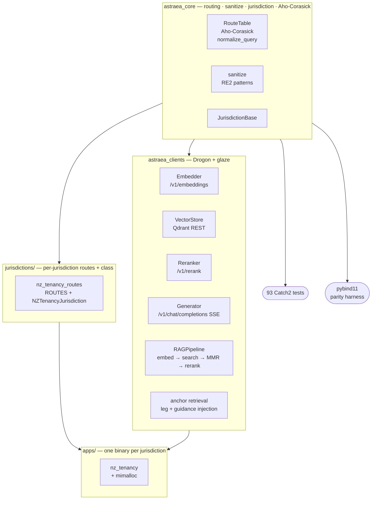
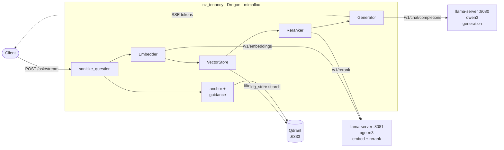

# astraea.cpp

C++ port of [astraea](https://github.com/jwongso/astraea) - a jurisdiction-aware
RAG server that answers legal tenancy questions via SSE token streaming.

**Why port?** The Python service is fragile on Gentoo: OS Python upgrades break
venvs, PyTorch races GPU allocation between processes. Goal: one static binary per
jurisdiction, no Python, no PyTorch, no venv, no surprises after `emerge -u @world`.

## Tech stack

| Concern | Library | Notes |
|---|---|---|
| HTTP server + SSE | [Drogon v1.9.7](https://github.com/drogonframework/drogon) | Fetched by CPM at configure time |
| JSON | [glaze v4.4.3](https://github.com/stephenberry/glaze) | Header-only, C++23 reflection; fetched by CPM |
| Regex | RE2 | System package; sanitize + routing |
| Memory allocator | [mimalloc](https://github.com/microsoft/mimalloc) | Linked per-executable via override TU |
| Logging | spdlog | System package |
| Tests | Catch2 3 | System package |
| Build | CMake 3.28 + Ninja | C++23, Clang primary |

## Architecture

**Library layers** - `astraea_core` has no network deps and links into tests and
the parity harness; `astraea_clients` adds Drogon and links into jurisdiction
binaries:



**Request flow** for `POST /ask/stream` (`POST /ask` is identical except
`Generator::generate()` replaces `generate_stream()` at the final step):



> `PORT` defaults to 8080 (the listener); `LLM_BASE_URL` also defaults to 8080.
> In production set `LLM_BASE_URL` explicitly so they don't collide.

## Prerequisites

**Ubuntu 24.04 (CI):**

```sh
sudo apt-get install -y \
  clang ninja-build cmake \
  libspdlog-dev libre2-dev catch2 \
  libjsoncpp-dev libssl-dev uuid-dev \
  zlib1g-dev libbrotli-dev libmimalloc-dev git
```

**Gentoo (production):**

```sh
emerge -n llvm-core/clang dev-build/cmake dev-build/ninja \
       dev-libs/spdlog dev-libs/re2 dev-cpp/catch \
       dev-libs/jsoncpp dev-libs/openssl sys-libs/zlib \
       app-arch/brotli dev-libs/mimalloc
```

Drogon and glaze are fetched automatically by CPM at configure time - no manual
install needed.

## Quick start

```sh
# Build
cmake --preset prod
cmake --build --preset prod -t nz_tenancy

# Run
PORT=8080 ./build-prod/apps/nz_tenancy/nz_tenancy &

# Health check
curl http://localhost:8080/health

# Non-streaming
curl -X POST http://localhost:8080/ask \
     -H 'Content-Type: application/json' \
     -d '{"question":"what is the bond limit?"}'

# Streaming (-N disables curl output buffering)
curl -N -X POST http://localhost:8080/ask/stream \
     -H 'Content-Type: application/json' \
     -d '{"question":"my landlord refuses to fix the heating"}'
```

See [apps/nz_tenancy/README.md](apps/nz_tenancy/README.md) for the full recipe.

## Build

```sh
# Dev: Clang/Debug + ASan + UBSan + Werror
cmake --preset dev
cmake --build --preset dev

# Run tests
ctest --preset dev --output-on-failure

# Prod: Release + O3 + LTO + znver5 (Zen 5 / Ryzen AI 9)
cmake --preset prod
cmake --build --preset prod
```

Build output:
- `build-dev/` or `build-prod/` depending on preset
- Tests: `build-dev/tests/`
- Apps: `build-dev/apps/nz_tenancy/nz_tenancy` (and others once added)

## CMake options

| Option | Default | Effect |
|---|---|---|
| `ASTRAEA_BUILD_TESTS` | ON | Build Catch2 unit tests |
| `ASTRAEA_BUILD_CLIENTS` | ON | Build HTTP client libs; pulls Drogon + glaze via CPM |
| `ASTRAEA_BUILD_APPS` | ON | Build jurisdiction binaries (requires CLIENTS) |
| `ASTRAEA_BUILD_BINDINGS` | ON | Build pybind11 differential parity module |
| `ASTRAEA_BUILD_BENCH` | OFF | Build RE2 vs std::regex microbenchmark |
| `ASTRAEA_NATIVE_OPTS` | ON | Apply `-march=znver5 -flto=thin` in Release |

Fast lean build (no Drogon, no apps, tests only):

```sh
cmake --preset dev -DASTRAEA_BUILD_CLIENTS=OFF -DASTRAEA_BUILD_BINDINGS=OFF
cmake --build --preset dev
ctest --preset dev --output-on-failure
```

## Parity harness

A pytest suite checks that the C++ output matches the Python reference for
routing and sanitize logic:

```sh
pip install pybind11 pytest
git clone https://github.com/jwongso/astraea ../astraea
cmake --preset dev -DASTRAEA_BUILD_BINDINGS=ON
cmake --build --preset dev -t _astraea_cpp
ASTRAEA_PY_PATH=../astraea pytest tests/diff/ -v
```

This is what the `pybind11 differential parity` CI job runs on every PR.

## Library structure

```
astraea_core       routing, sanitize, jurisdiction, aho_corasick, route_table
                   No Drogon dep - links into tests and pybind11 bindings.

astraea_clients    embedder, retriever, generator, reranker, pipeline, anchor
                   Requires Drogon. Links into jurisdiction app binaries.
```

## Test suite

93 tests across 6 files:

| File | Coverage |
|---|---|
| `test_routing.cpp` | `normalize_query`, route matching, all 20 NZ tenancy route fixtures |
| `test_sanitize.cpp` | Injection rejection, question sanitization |
| `test_ac.cpp` | Aho-Corasick automaton |
| `test_route_table.cpp` | `RouteTable` build + query |
| `test_pipeline_helpers.cpp` | `apply_manual_discounts`, `deduplicate`, `mmr_select`, `word_set`, `jaccard`, `is_leg_chunk` |
| `test_nz_tenancy_routes.cpp` | NZ tenancy route fixtures against the C++ route table |

## CI

Two GitHub Actions jobs on `ubuntu-24.04` (both use ccache + CPM source cache
for warm runs):

| Job | What it does |
|---|---|
| `Clang/Debug + ASan + UBSan` | Full build + 93 tests; ASan + UBSan enabled |
| `pybind11 differential parity` | Builds `_astraea_cpp` bindings, runs pytest parity suite against Python reference |

## Apps

| Binary | Status | Description |
|---|---|---|
| `apps/hello_sse` | Done (spike) | Validates Drogon async-coroutine + SSE spine |
| `apps/nz_tenancy` | In progress | NZ residential tenancy RAG server |

Each jurisdiction binary links `astraea_clients` + its route table +
`mimalloc_override.cpp` (global `new`/`delete` override). One binary, one
jurisdiction, one port. Spikes (`hello_sse`) are standalone and do not link
a route table or mimalloc override.

## Jurisdictions

Routes and jurisdiction config live under `jurisdictions/`:

```
jurisdictions/
  nz_tenancy/   routes.cpp/.hpp   20 statute routes for RTA 1986
  flensburg/    (future)          Flensburg tenancy law
```

## Environment variables

All config is read via `astraea::Config::from_env()` at startup:

| Variable | Default | Description |
|---|---|---|
| `PORT` | 8080 | TCP port |
| `LLM_BASE_URL` | `http://localhost:8080/v1` | llama-server (generation) |
| `EMBED_BASE_URL` | `http://localhost:8081/v1` | llama-server (embeddings) |
| `QDRANT_URL` | `http://localhost:6333` | Qdrant vector store |
| `REDIS_URL` | `redis://127.0.0.1:6379/0` | Session store |
| `LLM_MODEL` | `qwen3` | Model name sent to llama-server |
| `EMBED_MODEL` | `BAAI/bge-m3` | Embedding model name |
| `EMBED_DIMS` | 1024 | Embedding vector dimension; must match the Qdrant collection (bge-m3 = 1024, bge-base/small = 768) |
| `RERANK_BASE_URL` | `http://localhost:8081/v1` | Reranker endpoint (same llama-server as embeddings by default) |
| `RERANK_MODEL` | `BAAI/bge-m3` | Reranker model name |
| `LLM_MAX_TOKENS` | 2500 | Max tokens per generation response |
| `LLM_TEMPERATURE` | 0.2 | Sampling temperature for generation |
| `REWRITE_MAX_TOKENS` | 100 | Max tokens for query rewrite (short output; keep low) |
| `REWRITE_TEMPERATURE` | 0.0 | Temperature for query rewrite; 0.0 = deterministic |
| `LLM_GLOBAL_CONCURRENCY` | 0 | Max concurrent in-flight LLM calls; 0 = unlimited |
| `LLM_ACQUIRE_TIMEOUT_S` | 90 | Seconds to wait for an LLM permit before returning 503; 0 = wait forever |
| `IP_MAX_CONCURRENCY` | 3 | Max concurrent requests per source IP; 0 = unlimited (use proxy-level limiting behind Cloudflare Tunnel) |
| `ENABLE_RERANKER` | true | Set `false` to skip cross-encoder reranking |
| `ENABLE_THINKING` | true | Forward `chat_template_kwargs.enable_thinking` on generation requests; set `false` for non-Qwen3 backends |
| `PUBLIC_TOKEN` | (none) | `X-API-Key` value required on requests |
| `DEBUG_KEY` | (none) | Auth token for `/debug/*` endpoints |
| `ALLOWED_ORIGIN` | `*` | CORS allowed origin |

> Note: `LLM_BASE_URL` and `PORT` both default to `8080`. In production always
> set `LLM_BASE_URL` explicitly to point at the llama-server host/port so they
> do not collide with the application listener.

## License

MIT - see [LICENSE](LICENSE).
